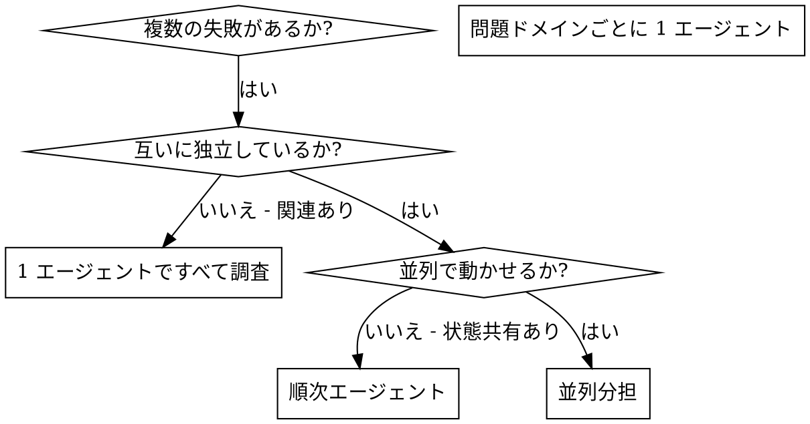

# 並列エージェントの分担起動（Dispatching Parallel Agents）

## 概要

タスクを、コンテキスト分離された専門エージェントに委譲する。指示と渡す情報を
正確に組み立てることで、エージェントを目的に集中させ、タスクを成功させる。
エージェントには現セッションのコンテキストや履歴を引き継がせない。**必要な
情報だけ**を構築して渡す。これにより自分自身のコンテキストも調整作業のために
温存できる。

複数の関係ないバグ・失敗（別ファイルのテスト・別サブシステム・別バグ）が
ある場合、順番に調査するのは時間の無駄。各調査が独立しているなら並列に
処理できる。

**コア原則:** 独立した問題ドメインごとに 1 エージェントを起動し、並列で
進める。

## 使うとき



**使う場面:**
- 3 ファイル以上のテストが、それぞれ別の根本原因で失敗している
- 複数のサブシステムが独立して壊れている
- 各問題が他のコンテキストなしで理解できる
- 調査間で状態を共有しない

**使わない場面:**
- 失敗が関連している（1つを直せば他も直るかも）
- システム全体の状態を把握する必要がある
- エージェント同士が干渉する（同じファイルを編集する等）

## 基本パターン

### 1. 独立したドメインを特定する

何が壊れているかでグルーピングする：
- ファイル A のテスト: ツール承認フロー
- ファイル B のテスト: バッチ完了の動作
- ファイル C のテスト: 中断機能

各ドメインは独立している（ツール承認を直しても中断テストには影響しない）。

### 2. 焦点を絞ったエージェントタスクを作る

各エージェントには以下を与える：
- **明確なスコープ:** 1 つのテストファイル or サブシステム
- **明確なゴール:** これらのテストを通す
- **制約:** 他のコードは変えない
- **期待する出力:** 何を発見し、何を修正したかのサマリ

### 3. 並列起動する

```typescript
// Claude Code / AI 環境で
Task("agent-tool-abort.test.ts の失敗を修正")
Task("batch-completion-behavior.test.ts の失敗を修正")
Task("tool-approval-race-conditions.test.ts の失敗を修正")
// 3 つが同時に走る
```

### 4. レビューと統合

エージェントが返ってきたら：
- 各サマリを読む
- **エージェントが重要だと指摘したファイルを Read する**（次のセクション参照）
- 修正同士が衝突していないか確認する
- フルテストスイートを実行する
- すべての変更を統合する

## エージェント結果の必読ルール（Required: Read Files Agents Return）

並列エージェントには必ず「最重要ファイル 5-10 個のリスト」を返させること。
メイン Claude は、受け取ったファイルを Read してから次のステップに進む。

### なぜか

エージェントの要約だけで判断を進めると、伝言ゲームになる。要約は情報を
圧縮するため、コーディング規約・局所的な慣習・暗黙の依存関係が抜け落ちる
ことが多い。特に既存コードベースへの実装では、メイン Claude が直接コードを
読んでいないと「動くが規約違反」「動くが既存パターンを破壊」という結果に
なりやすい。

feature-dev プラグイン（Anthropic 公式）では Phase 2 のコードベース調査で
この原則を明示的に強調している。harness にも同じ原則を適用する。

### エージェントへの指示テンプレート

タスク本体の最後に、以下を必ず含める：

```
## 必須出力
1. 調査結果のサマリ（どこに何があるか）
2. 必読ファイルリスト: メイン Claude が次のステップで読むべき重要ファイルを
   5-10 個、以下の形式で返すこと
   - {ファイルパス}:{行範囲} ← {なぜ重要か}

   例:
   - src/auth/AuthService.ts:45-120 ← 認証フローの中核
   - src/middleware/authMiddleware.ts:12-40 ← リクエスト認証
   - src/config/security.ts:8-25 ← セキュリティ設定
```

### Red Flag — 以下の思考が浮かんだら立ち止まる

| 思考 | 正しい対応 |
|---|---|
| 「エージェントが要約してくれたから読まなくていい」 | 必ず読む。要約だけで判断しない |
| 「ファイルリストを読むのは時間の無駄」 | 短く読み流すだけでも実装品質が大きく変わる |
| 「複数エージェントが返したファイルが重複している。片方だけ読む」 | 重複は重要度のシグナル。両方読む |
| 「タスクが急ぎだから読む時間がない」 | 急ぎほど誤りのコストが大きい。読んでから進める |
| 「ファイルが多すぎる。上位 2-3 個でいい」 | 5 個未満ならエージェントへの指示が広すぎる。指示を絞り直す |

### 読まないことのコスト（よくある失敗）

- 既存コードに同じヘルパー関数があるのに、新規に同名関数を作って二重実装になった
- 既存のエラーハンドリングパターンを無視して、独自のパターンで実装した
- DB スキーマの暗黙の制約（カスケード削除等）を見落として、データ不整合が発生した
- feature ファイルの「関連 NFR」セクションに記載された制約を実装で違反した

これらはすべて「エージェントの要約は読んだがファイルは読まなかった」ケースで
起きやすい。

## エージェントへのプロンプト構造

良いプロンプトは以下の3つを満たす：

1. **焦点が絞れている** — 問題ドメインが1つに明確
2. **自己完結している** — 問題を理解するのに必要な情報がすべて含まれる
3. **出力が具体的** — エージェントが何を返すべきかが明確

```markdown
src/agents/agent-tool-abort.test.ts の 3 件の失敗を修正してください：

1. "should abort tool with partial output capture" — メッセージに 'interrupted at' を期待
2. "should handle mixed completed and aborted tools" — 速いツールが完了ではなく中断扱いになっている
3. "should properly track pendingToolCount" — 3 件の結果を期待するが 0 件が返る

タイミング/競合状態の問題です。あなたのタスク：

1. テストファイルを読み、各テストが何を検証しているかを理解する
2. 根本原因を特定する — タイミング問題か、本物のバグか？
3. 以下の方針で修正する：
   - 任意のタイムアウトをイベントベースの待機に置き換える
   - 中断実装にバグがあれば直す
   - 仕様変更によるテスト期待値のズレなら期待値を調整する

タイムアウトを延ばすだけの対症療法は禁止。根本原因を見つけてください。

## 必須出力
1. 何を発見し、何を修正したかのサマリ
2. 必読ファイルリスト 5-10 個（必読ルール参照）
```

## よくある失敗

**❌ スコープが広すぎる:** 「全テストを直して」 — エージェントが迷走する
**✅ 具体的:** 「agent-tool-abort.test.ts を直して」 — 焦点が明確

**❌ コンテキストなし:** 「競合状態を直して」 — どこかが分からない
**✅ コンテキスト付き:** エラーメッセージとテスト名を貼る

**❌ 制約なし:** エージェントがすべてリファクタしてしまう
**✅ 制約付き:** 「本番コードは変えない」「テストだけ修正」

**❌ 出力が曖昧:** 「直して」 — 何が変わったか分からない
**✅ 具体的:** 「根本原因と変更点のサマリを返して」

## 使うべきでないとき

- **関連した失敗:** 1つを直せば他も直るかも → 一緒に調査
- **全体コンテキストが必要:** システム全体の状態を見ないと理解できない
- **探索的デバッグ:** 何が壊れているかまだ分からない
- **状態共有:** エージェント同士が同じファイル・同じリソースを触る

## 実セッション例

**シナリオ:** 大規模リファクタ後、3 ファイルにわたって 6 件のテスト失敗

**失敗:**
- agent-tool-abort.test.ts: 3 件失敗（タイミング問題）
- batch-completion-behavior.test.ts: 2 件失敗（ツール未実行）
- tool-approval-race-conditions.test.ts: 1 件失敗（実行回数 = 0）

**判断:** 独立ドメイン — 中断ロジックとバッチ完了と競合状態は別の問題

**起動:**
```
Agent 1 → agent-tool-abort.test.ts を修正
Agent 2 → batch-completion-behavior.test.ts を修正
Agent 3 → tool-approval-race-conditions.test.ts を修正
```

**結果:**
- Agent 1: タイムアウトをイベントベース待機に置換
- Agent 2: イベント構造のバグ（threadId の位置が間違い）を修正
- Agent 3: 非同期ツール実行の完了待機を追加

**統合:** すべての修正が独立、衝突なし、フルスイートが緑

**短縮効果:** 3 つの問題を順次ではなく並列で解決

## 主な利点

1. **並列化** — 複数の調査が同時進行
2. **集中** — 各エージェントの担当範囲が狭く、追跡するコンテキストが少ない
3. **独立性** — エージェント同士が干渉しない
4. **速度** — 3 つの問題を 1 つ分の時間で解決

## 検証

エージェントが返ってきた後：
1. **各サマリをレビュー** — 何が変わったか把握
2. **必読ファイルリストを Read** — 上記の必読ルールに従う
3. **衝突チェック** — エージェント同士が同じコードを触っていないか
4. **フルスイート実行** — 全修正が一緒に動くか確認
5. **抜き打ちチェック** — エージェントは系統的なミスを犯すことがある

## 実プロジェクトでの効果

デバッグセッション例（2025-10-03）：
- 3 ファイルで 6 件の失敗
- 3 エージェントを並列起動
- すべての調査が同時完了
- すべての修正が衝突なく統合
- エージェント間の変更に衝突ゼロ
