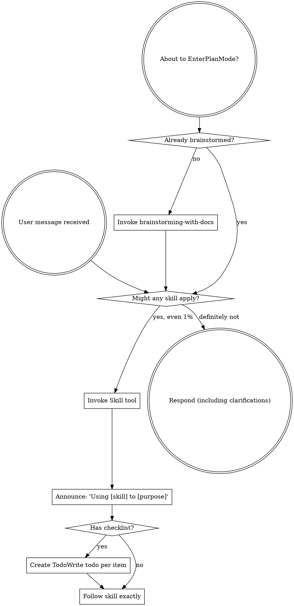

<SUBAGENT-STOP>
If you were dispatched as a subagent to execute a specific task, skip this skill.
</SUBAGENT-STOP>

<EXTREMELY-IMPORTANT>
If you think there is even a 1% chance a skill might apply to what you are doing, you ABSOLUTELY MUST invoke the skill.

IF A SKILL APPLIES TO YOUR TASK, YOU DO NOT HAVE A CHOICE. YOU MUST USE IT.

This is not negotiable. This is not optional. You cannot rationalize your way out of this.
</EXTREMELY-IMPORTANT>

## Instruction Priority

Superpowers-custom skills override default system prompt behavior, but **user instructions always take precedence**:

1. **User's explicit instructions** (CLAUDE.md, direct requests) — highest priority
2. **Superpowers-custom skills** — override default system behavior where they conflict
3. **Default system prompt** — lowest priority

If CLAUDE.md says "don't use TDD" and a skill says "always use TDD," follow the user's instructions. The user is in control.

## How to Access Skills

**In Claude Code:** Use the `Skill` tool. When you invoke a skill, its content is loaded and presented to you—follow it directly. Never use the Read tool on skill files.

# Available Skills

## プロセス系スキル（HOW を決めるスキル）

| スキル | 用途 |
|--------|------|
| **development-cycle** | **★ コード変更を伴う作業では最初に呼ぶ。フロー判定とスキル使用順序の決定** |
| brainstorming-with-docs | ブレインストーミング → ドキュメント出力（feature仕様, ADR等） |
| writing-plans | 実装計画の作成 |
| executing-plans | 計画に沿った実装の実行 |
| document-lifecycle | ドキュメント駆動開発（feature仕様, architecture.md, notes/ の作成・更新） |
| systematic-debugging | 体系的なデバッグ手法 |

## 実装系スキル（WHAT を作るスキル）

| スキル | 用途 |
|--------|------|
| web-testing | テスト戦略・TDD（E2E → 統合 → 単体、モック許可制度、Red-Green-Refactor） |
| ui-design | UI設計（画面一覧 → 共通レイアウト → 情報設計 → ワイヤーフレーム → ビジュアル） |
| project-structure | ディレクトリ構成（機能別 + 一方向依存 + コロケーション） |
| coding-standards | コーディング規約（TypeScript/React/Next.js）、ESLint/Prettier/Husky/lint-staged 設定 |
| claude-md-generator | プロジェクト CLAUDE.md の生成・更新（200行以下、Progressive Disclosure） |

## 環境・セットアップ系スキル

| スキル | 用途 |
|--------|------|
| project-setup | 既存プロジェクトの環境構築（依存インストール → 環境変数 → DB → 品質ツール → 動作確認） |
| project-migration | 既存プロジェクトへの途中導入（コード・ドキュメントから architecture.md + feature ファイル群を一括生成） |

## 品質管理・コラボレーション系スキル

| スキル | 用途 |
|--------|------|
| verification-before-completion | 作業完了前の検証チェック |
| requesting-code-review | コードレビュー依頼の出し方 |
| receiving-code-review | コードレビュー指摘への対応 |
| security-review | セキュリティチェック（OWASP Top 10:2025、Next.js固有、インフラ設定） |

## Git・ワークフロー系スキル

| スキル | 用途 |
|--------|------|
| git-conventions | コミットメッセージ規約（Conventional Commits）、ブランチ命名規則、コンフリクト解消 |
| remote-repository | PR/MR作成、Issue管理、CI/CD設定（GitHub/GitLab/Bitbucket対応） |
| using-git-worktrees | Git worktree を使った並行作業 |
| finishing-a-development-branch | 開発ブランチの完了・マージ手順 |

## エージェント制御系スキル

| スキル | 用途 |
|--------|------|
| dispatching-parallel-agents | 並列サブエージェントの起動 |
| subagent-driven-development | サブエージェントを活用した開発 |

## メタスキル

| スキル | 用途 |
|--------|------|
| writing-skills | 新しいスキルの作成方法 |

# Using Skills

## ★ 必須ルール：development-cycle スキル

**コード変更を伴う作業（実装、修正、改修、リファクタ等）では、他のどのスキルよりも先に development-cycle スキルを呼び出すこと。**

development-cycle スキルが以下を統括する：
- 作業の種類を判定し、適切なフローを選択する
- **テスト駆動（TDD鉄則）** と **ドキュメント駆動** の原則を強制する
- 使うべきスキルの順序を指示する

コード変更を伴わない作業（質問、調査、ドキュメントのみの作業）では不要。

## The Rule

**Invoke relevant or requested skills BEFORE any response or action.** Even a 1% chance a skill might apply means that you should invoke the skill to check. If an invoked skill turns out to be wrong for the situation, you don't need to use it.

## スキル選択の典型パターン

| ユーザーの指示 | 最初に使うスキル | development-cycle が指示するフロー |
|---------------|-----------------|----------------------------------|
| 「〇〇を作りたい」 | **development-cycle** | フロー A → brainstorming-with-docs → document-lifecycle → web-testing → ui-design |
| 「〇〇のバグを直して」 | **development-cycle** | フロー B → web-testing（再現テスト）→ systematic-debugging → 修正 |
| 「リファクタして」 | **development-cycle** | フロー C → 既存テスト確認 → リファクタ → テスト緑維持 |
| 「UIを作って」 | **development-cycle** | フロー D → ui-design → web-testing → 実装 |
| 「仕様が変わった」 | **development-cycle** | フロー E → document-lifecycle → web-testing → 実装修正 |
| 「テストを書いて」 | web-testing | — （コード変更なしならdevelopment-cycle不要） |
| 「feature仕様を書いて」 | document-lifecycle | — （ドキュメントのみならdevelopment-cycle不要） |
| 「考えたい」「ブレスト」 | brainstorming-with-docs | — |
| 「計画を立てて」 | brainstorming-with-docs → writing-plans | — |
| 「レビューして」 | requesting-code-review | — |
| 「セキュリティチェックして」 | security-review | — （修正が必要なら development-cycle フロー B） |
| 「PRを出して」「マージして」 | finishing-a-development-branch → remote-repository | — |
| 「コミットして」「ブランチ作って」 | git-conventions | — |
| 「CI設定して」「Issue作って」 | remote-repository | — |
| 「ESLint入れて」「コード規約を設定して」 | coding-standards | — |
| 「環境構築して」「セットアップして」 | project-setup | — |
| 「ハーネスを導入して」「既存プロジェクトに適用して」 | project-migration | — |

## Red Flags

These thoughts mean STOP—you're rationalizing:

| Thought | Reality |
|---------|---------|
| "This is just a simple question" | Questions are tasks. Check for skills. |
| "I need more context first" | Skill check comes BEFORE clarifying questions. |
| "Let me explore the codebase first" | Skills tell you HOW to explore. Check first. |
| "I can check git/files quickly" | Files lack conversation context. Check for skills. |
| "Let me gather information first" | Skills tell you HOW to gather information. |
| "This doesn't need a formal skill" | If a skill exists, use it. |
| "I remember this skill" | Skills evolve. Read current version. |
| "This doesn't count as a task" | Action = task. Check for skills. |
| "The skill is overkill" | Simple things become complex. Use it. |
| "I'll just do this one thing first" | Check BEFORE doing anything. |
| "This feels productive" | Undisciplined action wastes time. Skills prevent this. |
| "I know what that means" | Knowing the concept ≠ using the skill. Invoke it. |
| "ドキュメントは後で書く" | document-lifecycle を先に確認。後では書かない。 |
| "テストは実装の後で" | web-testing の TDD 鉄則を確認。テストが先。 |
| "小さい修正だからフロー不要" | development-cycle を呼ぶ。小さくてもフロー B か C に該当する。 |
| "development-cycle は大げさ" | フローの判定は30秒で終わる。スキップのリスクの方が大きい。 |
| "実装してからテストを書く" | TDD 鉄則違反。実装を削除してテストから書き直す。 |
| "モックすればテストできる" | web-testing のモック許可制度を確認。DB・内部APIのモックは禁止。 |
| "feature仕様なしで実装を始める" | document-lifecycle を呼ぶ。要件定義が先。 |
| "コードがドキュメント" | コードは HOW。WHY と WHAT はドキュメントに書く。 |
| "セキュリティは後で確認" | security-review を呼ぶ。問題は早期発見が重要。 |
| "コミットメッセージは適当でいい" | git-conventions を確認。Conventional Commits に従う。 |
| "PR の説明は省略" | remote-repository のテンプレートに従って記載する。 |
| "mainに直接push" | ブランチを切ってPRを出す。git-conventions を確認。 |
| "any 型でいい" | coding-standards を確認。unknown を使う。 |
| "ESLint なしで始める" | coding-standards で品質ツールを設定してから開発を始める。 |

## Skill Priority

When multiple skills could apply, use this order:

1. **development-cycle first** — コード変更を伴う作業では、他のすべてに先立って呼ぶ
2. **Process skills** (brainstorming-with-docs, document-lifecycle, systematic-debugging, writing-plans) - development-cycle が指示する順序で使う
3. **Implementation skills** (web-testing, ui-design) - development-cycle が指示する順序で使う
4. **Quality/security skills** (verification-before-completion, security-review, review skills) - フローの最後に使う
5. **Git/workflow skills** (git-conventions, remote-repository, using-git-worktrees, finishing-a-development-branch) - コミット・PR時に使う

## Skill Types

**Rigid** (development-cycle, web-testing, document-lifecycle, security-review, git-conventions, coding-standards): Follow exactly. Don't adapt away discipline.

**Flexible** (ui-design, brainstorming-with-docs, remote-repository, project-setup): Adapt principles to context.

The skill itself tells you which.

## User Instructions

Instructions say WHAT, not HOW. "Add X" or "Fix Y" doesn't mean skip workflows.
